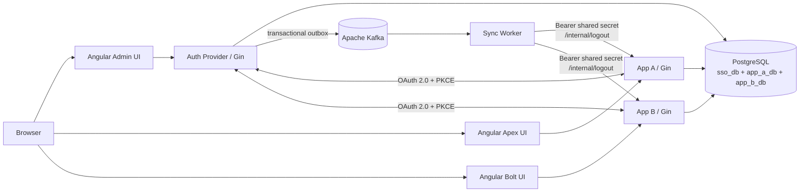
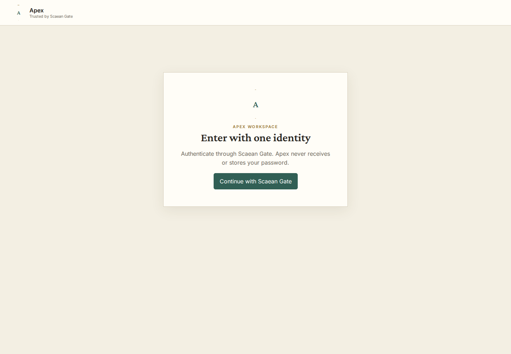
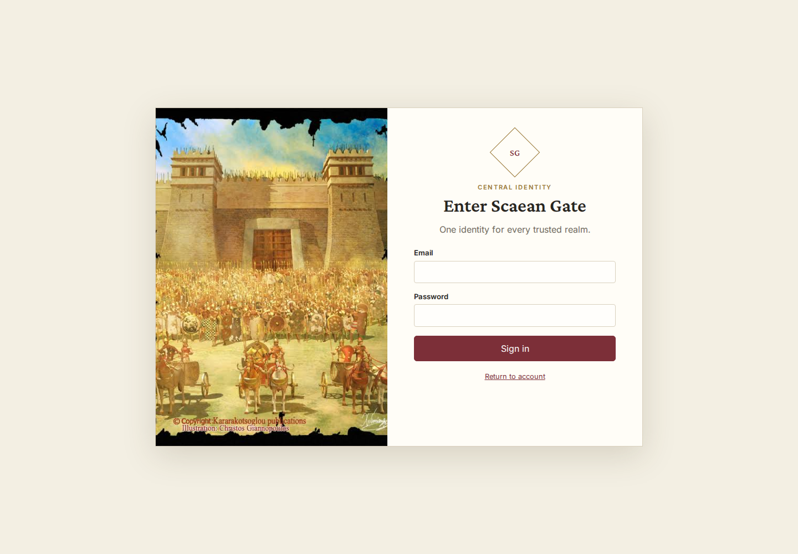
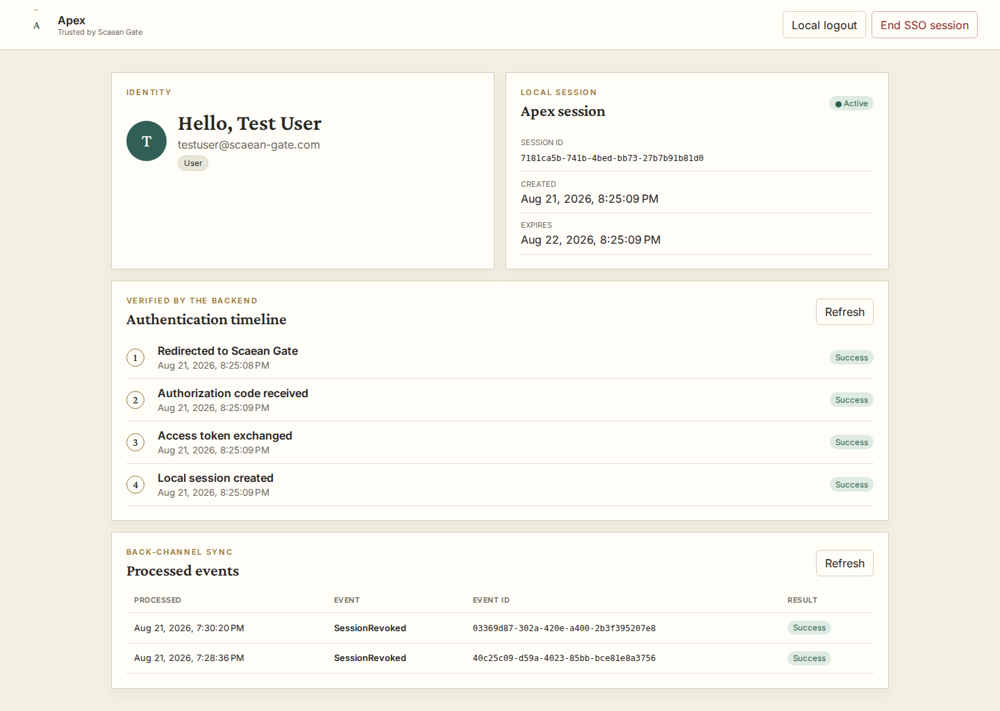
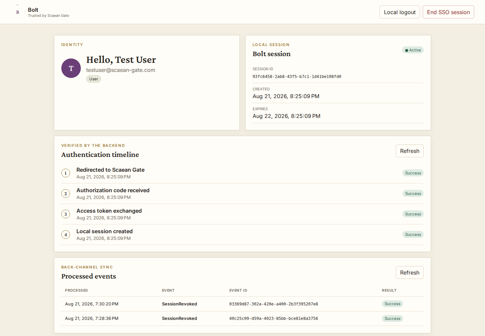
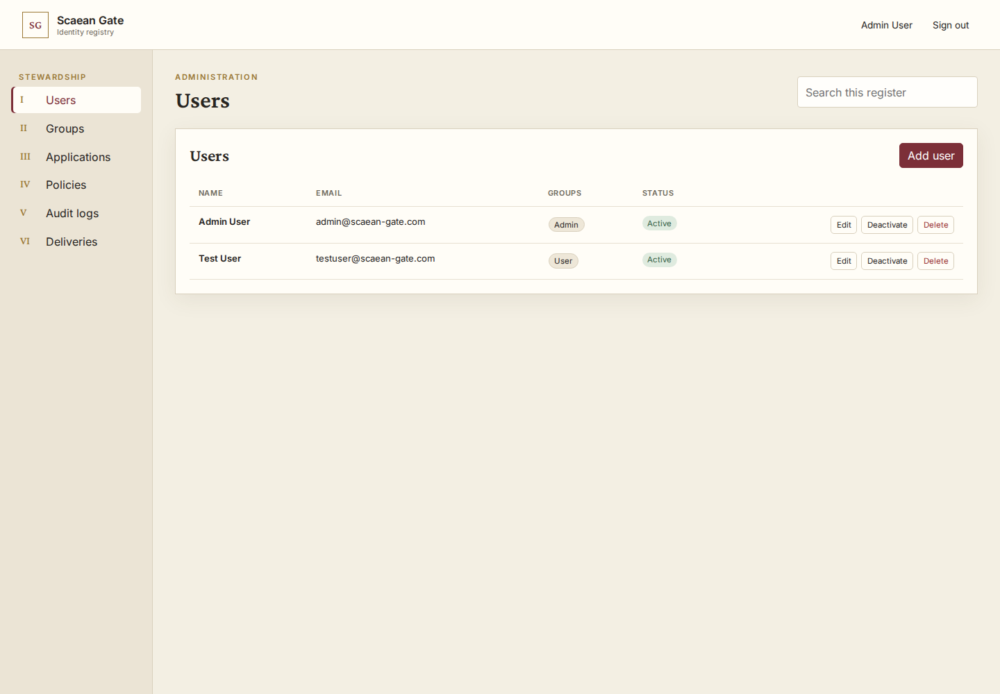
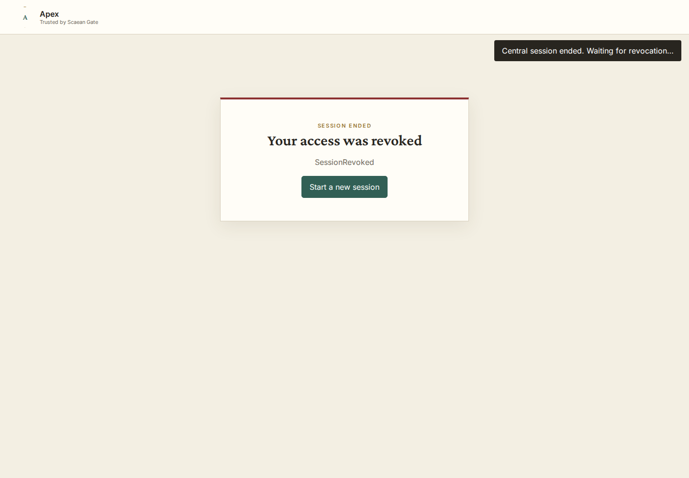

# Scaean Gate

A centralized Identity and Authorization Provider with OAuth 2.0 Authorization Code + PKCE, group-based application access, independent relying-application sessions, and Kafka-backed session revocation.

App A bernama **Apex**, sedangkan App B bernama **Bolt**.

## Identitas

| Data | Nilai |
| --- | --- |
| Nama | Daniel Arrigo Manurung |
| NIM | 18224031 |

## Panduan Menjalankan Sistem

### Prasyarat

- Docker Engine dengan Docker Compose
- Memori kosong minimal 4 GB untuk PostgreSQL, Kafka, layanan Go, dan tiga frontend

### Konfigurasi

Salin konfigurasi development yang telah disediakan:

```bash
cp .env.example .env
```

Nilai pada `.env.example` dapat langsung digunakan untuk menjalankan sistem secara lokal. Ganti seluruh secret dan gunakan `COOKIE_SECURE=true` sebelum deployment produksi. `.env` diabaikan oleh Git dan tidak boleh di-commit.

### Menjalankan Sistem

Jalankan dari root repositori:

```bash
docker compose up --build
```

Untuk menjalankan di background dan menunggu seluruh health check:

```bash
docker compose up -d --build --wait
docker compose ps
```

### Pembuatan Database, Migrasi, dan Seeder

Seeder membuat data berikut:

- `admin@scaean-gate.com` di dalam grup **Admin**
- `testuser@scaean-gate.com` di dalam grup **User**
- OAuth client Apex dan Bolt, redirect URI, serta kebijakan `allow` untuk grup User

Kedua pengguna pada awalnya menggunakan nilai `SEED_USER_PASSWORD` dari `.env`.

Untuk membuat ulang seluruh database dan menjalankan inisialisasi dari kondisi bersih:

```bash
docker compose down -v
docker compose up -d --build --wait
```

> Penghapusan volume akan menghapus seluruh data lokal secara permanen.

### URL Akses

| Komponen | URL | Kegunaan |
| --- | --- | --- |
| Admin Control Panel | <http://localhost:4200> | Profil pusat dan pengelolaan administratif |
| Apex (App A) | <http://localhost:4201> | Relying application independen pertama |
| Bolt (App B) | <http://localhost:4202> | Relying application independen kedua |
| Auth Provider API | <http://localhost:8080> | API autentikasi, OAuth, kebijakan, dan administrasi |
| App A API | <http://localhost:8081> | Callback OAuth Apex dan API sesi lokal |
| App B API | <http://localhost:8082> | Callback OAuth Bolt dan API sesi lokal |
| PostgreSQL | `localhost:5432` | Akses database dari host |
| Kafka | `localhost:9092` | Akses message broker dari host |
| Probe Sync Worker | Port internal `8083` | API health khusus jaringan container |

### Menghentikan Sistem

```bash
docker compose down
```

Gunakan `docker compose down -v` hanya jika volume database juga ingin dihapus.

## Arsitektur dan Alur Request



### Alur Sign-in dan SSO

1. Apex atau Bolt membuat PKCE verifier acak, challenge `S256`, dan nilai state OAuth.
2. Relying application mengarahkan browser ke `GET /authorize` pada Auth Provider.
3. Jika cookie SSO pusat belum tersedia, pengguna melakukan sign-in melalui UI pusat.
4. Auth Provider memeriksa pengguna aktif, client terdaftar, kecocokan persis redirect URI, serta kebijakan grup terhadap aplikasi.
5. Auth Provider membuat authorization code berumur pendek dan sekali pakai, lalu mengarahkan browser ke callback relying application.
6. Relying application menukarkan code dan verifier melalui `POST /token` menggunakan client credential miliknya.
7. Auth Provider memvalidasi PKCE dan menerbitkan opaque access token.
8. Relying application memanggil `GET /userinfo`, menyimpan cache profil, membuat sesi lokal, dan memasang cookie lokal yang independen.
9. Sesi pusat yang sama dapat digunakan untuk masuk ke relying application lainnya tanpa memasukkan credential kembali.

### Local Logout

`POST /logout` pada Apex atau Bolt hanya mencabut sesi lokal aplikasi tersebut. Sesi SSO pusat dan sesi aplikasi lainnya tetap aktif.

### SSO Logout dan Pencabutan Asinkron

1. `POST /logout` pada Auth Provider mencabut sesi pusat beserta token OAuth terkait.
2. Pada transaksi database yang sama, event disimpan ke transactional outbox.
3. Outbox publisher mengirim event ke topik Kafka `sso-session-events`.
4. Sync Worker mengonsumsi event dan membuat catatan delivery untuk setiap aplikasi tujuan.
5. Worker memanggil endpoint `POST /internal/logout` pada setiap aplikasi terdampak.
6. Relying application mengautentikasi worker, mencabut sesi lokal terkait secara idempoten, dan mencatat aktivitas.
7. Delivery yang gagal akan dicoba kembali; event yang melewati batas percobaan dikirim ke `sso-session-events-dlq`.

Perubahan password dan hilangnya otorisasi akibat perubahan grup, aplikasi, atau kebijakan menggunakan jalur pencabutan yang sama.

## Keputusan Teknis

### Opaque Token Dibandingkan JWT

- **Pilihan:** access token berupa nilai opaque acak; hash dan statusnya disimpan secara terpusat.
- **Validasi:** relying application mengambil identitas melalui `/userinfo`.
- **Kelebihan:** pencabutan berlaku langsung, token tidak membocorkan data, dan perubahan grup tidak meninggalkan claim lama.
- **Konsekuensi:** validasi memerlukan lookup ke Auth Provider sehingga bergantung pada ketersediaan database.

### Apache Kafka sebagai Message Broker

- Membawa event `SessionRevoked`, `PasswordChanged`, dan `AccessPolicyChanged`.
- Memisahkan transaksi Auth Provider dari ketersediaan Apex dan Bolt.
- Mendukung consumer group, retry, delivery tracking, dan dead-letter topic.
- Menggunakan transactional outbox agar perubahan data selalu memiliki event yang tahan lama.

### Autentikasi Service-to-Service

- Sync Worker memanggil `POST /internal/logout` dengan `Authorization: Bearer <INTERNAL_API_SECRET>`.
- Apex dan Bolt memvalidasi shared secret dari environment variable.
- Endpoint hanya ditujukan untuk jaringan internal Compose dan tidak menggunakan cookie browser.
- Deployment produksi multi-host sebaiknya menambahkan TLS/mTLS atau workload identity.

### Retensi Data dan Penghapusan

- Pengguna, grup, keanggotaan, aplikasi, redirect URI, dan kebijakan menggunakan soft deletion (`deleted_at`).
- Sesi dan token dipertahankan dengan status seperti `revoked` atau `expired`.
- Audit log, event, delivery, cache profil, dan processed event dipertahankan sebagai riwayat operasional.
- Strategi ini menjaga bukti keamanan, kemampuan retry, relasi historis, dan idempotensi.

### Batas Kepemilikan Sesi

- Auth Provider memiliki sesi SSO pusat.
- Apex dan Bolt memiliki sesi lokal dan database masing-masing.
- Local logout hanya menghapus sesi aplikasi terkait.
- Pencabutan sesi pusat dipropagasikan secara asinkron melalui Kafka.

### Mekanisme Keamanan

- Authorization Code flow dengan PKCE `S256`.
- Authorization code berumur pendek dan sekali pakai.
- Redirect URI harus cocok secara persis.
- Password, client secret, opaque token, dan identifier sesi disimpan dalam bentuk hash sesuai kebutuhan.
- Cookie menggunakan HTTP-only dengan konfigurasi secure cookie.
- Request ID, format error terstruktur, audit log, allow-list CORS, dan event idempoten.
- Seluruh secret diberikan melalui environment variable.

## Tech Stack dan Versi

| Bagian | Teknologi | Versi |
| --- | --- | --- |
| Backend | Go, Gin, GORM | 1.25.0, 1.12.0, 1.31.2 |
| Frontend | TypeScript, Angular | 5.9.3, 21.2.21 |
| Database | PostgreSQL | 16 |
| Message broker | Apache Kafka, ZooKeeper | 7.5.0 |
| Web server | NGINX | 1.27 |
| Container | Docker, Docker Compose | Compose Specification |

## Daftar Endpoint API

### Auth Provider — `http://localhost:8080`

| Method | Path | Autentikasi | Kegunaan |
| --- | --- | --- | --- |
| GET | `/health` | Publik | Pemeriksaan readiness untuk kompatibilitas |
| GET | `/health/live` | Publik | Liveness proses |
| GET | `/health/ready` | Publik | Readiness PostgreSQL dan Kafka |
| POST | `/login` | Publik | Mengautentikasi dan membuat sesi SSO pusat |
| POST | `/logout` | Sesi pusat | Mencabut sesi SSO pusat |
| POST | `/change-password` | Sesi pusat | Mengubah password dan mencabut akses terkait |
| GET | `/profile` | Sesi pusat | Mengambil profil pusat saat ini |
| GET | `/authorize` | Sesi pusat/parameter OAuth | Memulai atau melanjutkan authorization code flow |
| POST | `/token` | OAuth client credential | Menukarkan code + PKCE verifier dengan opaque token |
| GET | `/userinfo` | Opaque bearer token | Mengambil identitas/profil pemilik token |
| GET | `/admin/users` | Sesi pusat admin | Menampilkan daftar pengguna |
| POST | `/admin/users` | Sesi pusat admin | Membuat pengguna |
| GET | `/admin/users/:id` | Sesi pusat admin | Mengambil detail pengguna |
| PUT | `/admin/users/:id` | Sesi pusat admin | Memperbarui pengguna |
| DELETE | `/admin/users/:id` | Sesi pusat admin | Menghapus pengguna secara soft-delete |
| PATCH | `/admin/users/:id/status` | Sesi pusat admin | Mengaktifkan/menonaktifkan pengguna |
| GET | `/admin/groups` | Sesi pusat admin | Menampilkan daftar grup |
| POST | `/admin/groups` | Sesi pusat admin | Membuat grup |
| GET | `/admin/groups/:id` | Sesi pusat admin | Mengambil grup beserta anggotanya |
| PUT | `/admin/groups/:id` | Sesi pusat admin | Memperbarui grup |
| DELETE | `/admin/groups/:id` | Sesi pusat admin | Menghapus grup secara soft-delete |
| POST | `/admin/groups/:id/users` | Sesi pusat admin | Menambahkan pengguna ke grup |
| DELETE | `/admin/groups/:id/users/:user_id` | Sesi pusat admin | Menghapus pengguna dari grup |
| GET | `/admin/apps` | Sesi pusat admin | Menampilkan daftar aplikasi |
| POST | `/admin/apps` | Sesi pusat admin | Mendaftarkan aplikasi dan menerbitkan secret sekali |
| GET | `/admin/apps/:id` | Sesi pusat admin | Mengambil detail aplikasi |
| PUT | `/admin/apps/:id` | Sesi pusat admin | Memperbarui aplikasi |
| DELETE | `/admin/apps/:id` | Sesi pusat admin | Menghapus aplikasi secara soft-delete |
| POST | `/admin/apps/:id/redirect-uris` | Sesi pusat admin | Menambahkan redirect URI persis |
| DELETE | `/admin/apps/:id/redirect-uris/:uri_id` | Sesi pusat admin | Menghapus redirect URI secara soft-delete |
| GET | `/admin/policies` | Sesi pusat admin | Menampilkan daftar kebijakan akses |
| POST | `/admin/policies` | Sesi pusat admin | Membuat kebijakan akses |
| GET | `/admin/policies/:id` | Sesi pusat admin | Mengambil detail kebijakan akses |
| PUT | `/admin/policies/:id` | Sesi pusat admin | Memperbarui kebijakan akses |
| DELETE | `/admin/policies/:id` | Sesi pusat admin | Menghapus kebijakan akses secara soft-delete |
| GET | `/admin/audit-logs` | Sesi pusat admin | Menampilkan catatan audit keamanan |
| GET | `/admin/events` | Sesi pusat admin | Menampilkan event pencabutan beserta delivery |

### API Apex dan Bolt — port `8081` dan `8082`

Kedua relying application mengimplementasikan path yang sama.

| Method | Path | Autentikasi | Kegunaan |
| --- | --- | --- | --- |
| GET | `/health` | Publik | Pemeriksaan readiness untuk kompatibilitas |
| GET | `/health/live` | Publik | Liveness proses |
| GET | `/health/ready` | Publik | Readiness PostgreSQL lokal |
| GET | `/auth/login` | Publik | Membuat state OAuth/PKCE dan redirect ke Auth Provider |
| GET | `/auth/callback` | OAuth state + authorization code | Menukarkan code dan membuat sesi lokal |
| GET | `/session-status` | Sesi lokal opsional | Mengambil state sesi untuk browser |
| POST | `/internal/logout` | Internal bearer secret | Memproses pencabutan pusat secara idempoten |
| GET | `/me` | Sesi lokal | Mengambil profil lokal yang di-cache |
| GET | `/events` | Sesi lokal | Mengambil state event lokal |
| GET | `/activity` | Sesi lokal | Mengambil aktivitas autentikasi lokal |
| POST | `/logout` | Sesi lokal | Mencabut sesi aplikasi lokal saja |

### Sync Worker — port internal `8083`

| Method | Path | Autentikasi | Kegunaan |
| --- | --- | --- | --- |
| GET | `/health/live` | Internal/publik di dalam jaringan | Liveness proses worker |
| GET | `/health/ready` | Internal/publik di dalam jaringan | Readiness PostgreSQL dan Kafka |

## Fitur Bonus

| Bonus | Status | Implementasi |
| --- | --- | --- |
| B01 | Tidak diimplementasikan | — |
| B02 | Tidak diimplementasikan | — |
| B03 | Selesai | Probe liveness/readiness terpisah dengan pemeriksaan dependency PostgreSQL/Kafka dan health check Compose |
| B04 | Selesai | Penanganan SIGINT/SIGTERM, graceful HTTP shutdown, batas waktu drain, pembatalan outbox, dan penutupan resource di seluruh layanan backend |

## Screenshots

### Apex Sign-in



### Central Identity Login



### Apex Session After OAuth 2.0 + PKCE



### Bolt Using the Existing SSO Session



### Administrative Control Panel



### Asynchronously Revoked Application Session


