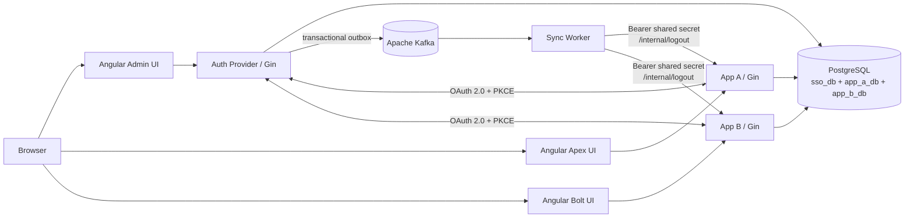

# Scaean Gate

Centralized Identity and Authorization Provider with OAuth 2.0 Authorization Code + PKCE, group-based application access, independent relying-application sessions, and Kafka-backed session revocation.

## Identity

| Field | Value |
| --- | --- |
| Name | Daniel Arrigo Manurung |
| NIM | 18224031 |

## System execution guide

### Prerequisites

- Docker Engine with Docker Compose
- At least 4 GB of free memory for PostgreSQL, Kafka, the Go services, and the three frontends
- Node.js/npm are only required when running Playwright outside Docker

### Configuration

Create the local environment file:

```bash
cp .env.example .env
```

Fill every blank value in `.env` with a strong, unique secret:

```dotenv
DB_USER=sso_user
DB_PASSWORD=<strong-database-password>
SEED_USER_PASSWORD=<initial-password-for-both-seeded-users>
APP_A_CLIENT_SECRET=<strong-app-a-secret>
APP_B_CLIENT_SECRET=<strong-app-b-secret>
INTERNAL_API_SECRET=<strong-worker-to-app-secret>
COOKIE_SECURE=false
```

`.env` is ignored by Git and must not be committed. `COOKIE_SECURE=false` is required for local HTTP. Set it to `true` behind HTTPS.

### Start the system

From the repository root:

```bash
docker compose up --build
```

To start in the background and wait for health checks:

```bash
docker compose up -d --build --wait
docker compose ps
```

### Database creation, migrations, and seeders

No separate migration command is required:

1. On the first PostgreSQL startup, `scripts/init-databases.sh` creates `sso_db`, `app_a_db`, and `app_b_db`.
2. The Auth Provider runs GORM `AutoMigrate` for central identity, OAuth, policy, audit, event, and delivery tables at startup.
3. App A and App B run `AutoMigrate` for their local session, profile cache, processed-event, and activity tables at startup.
4. The Auth Provider then runs an idempotent seeder at startup.

The seeder creates:

- `admin@scaean-gate.com` in the **Admin** group
- `testuser@scaean-gate.com` in the **User** group
- Apex and Bolt OAuth clients, redirect URIs, and User-group allow policies

Both users initially use `SEED_USER_PASSWORD` from `.env`.

To recreate all databases and rerun initialization from a clean state:

```bash
docker compose down -v
docker compose up -d --build --wait
```

> Removing the volume permanently deletes local data.

### Access URLs

| Component | URL | Purpose |
| --- | --- | --- |
| Admin Control Panel | <http://localhost:4200> | Central profile and administrative management |
| Apex (App A) | <http://localhost:4201> | First independent relying application |
| Bolt (App B) | <http://localhost:4202> | Second independent relying application |
| Auth Provider API | <http://localhost:8080> | Authentication, OAuth, policy, and admin API |
| App A API | <http://localhost:8081> | Apex OAuth callback and local session API |
| App B API | <http://localhost:8082> | Bolt OAuth callback and local session API |
| PostgreSQL | `localhost:5432` | Host database access |
| Kafka | `localhost:9092` | Host broker access |
| Sync Worker probe | Internal port `8083` | Container-only worker health API |

### Stop the system

```bash
docker compose down
```

Use `docker compose down -v` only when the database volume should also be removed.

### Tests

Run backend tests:

```bash
(cd auth-provider/server && go test ./...)
(cd auth-provider/sync-worker && go test ./...)
(cd applications/app-a && go test ./...)
(cd applications/app-b && go test ./...)
```

Run the two critical Playwright flows in an isolated Compose project:

```bash
cd e2e
npm ci
npm run install:browsers
npm run test:docker
```

The E2E runner temporarily stops a running default Compose project, creates a clean isolated stack, tests Authorization Code + PKCE with local/SSO logout, removes the test stack and volume, and restarts the default project when necessary.

## Architecture and request flows



### Sign-in and SSO flow

1. Apex or Bolt generates a random PKCE verifier, its `S256` challenge, and an OAuth state value.
2. The relying app redirects the browser to `GET /authorize` at the Auth Provider.
3. If no central SSO cookie exists, the user signs in through the central UI.
4. The Auth Provider checks the active user, registered client, exact redirect URI, and group/application policy.
5. It creates a short-lived, single-use authorization code and redirects to the relying app callback.
6. The relying app exchanges the code and verifier at `POST /token` using its client credentials.
7. The Auth Provider validates PKCE and issues an opaque access token.
8. The relying app calls `GET /userinfo`, caches the profile, creates its own local session, and sets an independent local cookie.
9. A central session can therefore sign the browser into the other relying app without entering credentials again.

### Local logout

`POST /logout` on Apex or Bolt revokes only that application's local session. The central SSO session and the other application's session remain active.

### SSO logout and asynchronous revocation

1. `POST /logout` at the Auth Provider revokes the central session and associated OAuth tokens.
2. In the same database transaction, an event is persisted to the transactional outbox.
3. The outbox publisher sends the event to `sso-session-events` in Kafka.
4. The Sync Worker consumes the event and creates per-application delivery records.
5. It calls each affected application's `POST /internal/logout` endpoint.
6. The relying app authenticates the worker, idempotently revokes matching local sessions, and records activity.
7. Failed deliveries are retried; exhausted events are sent to `sso-session-events-dlq`.

Password changes and authorization loss from group, application, or policy changes use the same revocation path.

## Technical decisions

### Opaque tokens instead of JWTs

Access tokens are cryptographically random opaque values whose hashes/state are stored centrally. Resource applications resolve identity through `/userinfo` rather than trusting self-contained claims.

Consequences:

- Revocation and expiry take effect immediately at the Auth Provider.
- Group and account changes do not leave stale authorization claims inside a signed token.
- Tokens reveal no user or authorization data to clients.
- Validation requires an Auth Provider lookup, unlike offline JWT verification, so database availability and latency matter.

### Apache Kafka message broker

Kafka 7.5.0 carries `SessionRevoked`, `PasswordChanged`, and `AccessPolicyChanged` events. It decouples central identity transactions from relying-app availability, supports ordered consumption within the configured partition, consumer-group processing, retries, delivery observability, and a dead-letter topic. A transactional database outbox prevents identity changes from being committed without a durable event record.

### Service-to-service authentication

The Sync Worker calls `POST /internal/logout` using:

```http
Authorization: Bearer <INTERNAL_API_SECRET>
```

App A and App B compare the supplied value against the environment-provided shared secret. This endpoint is not authenticated by browser cookies and is intended only for the trusted internal Compose network. In a multi-host production deployment, TLS/mTLS or a managed workload identity should be added.

### Data retention and deletion

Administrative resources use soft deletion (`deleted_at`) so normal queries exclude deleted records while auditability and historical relationships remain available. This applies to users, groups, user-group memberships, applications, redirect URIs, and access policies.

Sessions and tokens are retained with lifecycle statuses such as revoked or expired. Audit logs, outbox events, delivery attempts, local activity, profile caches, and processed-event records are historical/operational records rather than administratively deleted resources. This preserves security evidence, retry state, and idempotency.

### Session boundaries

The Auth Provider owns the central SSO session. Apex and Bolt each own a separate local session and database. Local logout does not mutate central state; central revocation propagates asynchronously to local state.

### Security measures

- Authorization Code flow with PKCE `S256`
- Short-lived, single-use authorization codes
- Exact redirect URI matching
- Hashed passwords and client secrets
- Hashed opaque tokens/session identifiers where applicable
- HTTP-only cookies and configurable secure-cookie enforcement
- Request IDs, structured error responses, audit logs, CORS allow-listing, and idempotent event handling
- Secrets supplied only through environment variables

## Technology stack and versions

Versions below are the pinned container versions or resolved direct dependency versions in the committed lock/module files.

| Category | Technology | Version |
| --- | --- | --- |
| Backend language/build image | Go | 1.25.0 / `golang:1.25-alpine` |
| HTTP framework | Gin | 1.12.0 |
| ORM | GORM | 1.31.2 |
| PostgreSQL driver | `gorm.io/driver/postgres` | 1.6.2 |
| Kafka Go client | franz-go | 1.21.6 |
| UUID | `google/uuid` | 1.6.0 |
| Password/crypto library | `golang.org/x/crypto` | 0.54.0 Auth Provider; 0.48.0 relying apps |
| Environment loader | `godotenv` | 1.5.1 |
| Frontend language | TypeScript | 5.9.3 |
| Frontend framework | Angular | 21.2.21 |
| Angular CLI/build | Angular CLI / Build | 21.2.21 |
| Reactive library | RxJS | 7.8.2 |
| Angular runtime helpers | Zone.js / tslib | 0.16.2 / 2.8.1 |
| Frontend build runtime | Node.js | `node:22-alpine` |
| Frontend package manager | npm | 10.9.4 |
| Static web server | NGINX | `nginx:1.27-alpine` |
| Runtime base image | Alpine Linux | 3.22 |
| Database | PostgreSQL | `postgres:16-alpine` |
| Message broker | Apache Kafka (Confluent image) | 7.5.0 |
| Coordination service | Apache ZooKeeper (Confluent image) | 7.5.0 |
| E2E framework | Playwright Test | 1.62.1 |
| E2E environment loader | dotenv | 17.4.2 |
| Container orchestration | Docker Compose | Compose Specification (`docker-compose.yml`) |

Exact transitive Go and npm dependencies are recorded in each service's `go.sum` and `package-lock.json`.

## API endpoints

### Auth Provider — `http://localhost:8080`

| Method | Path | Authentication | Purpose |
| --- | --- | --- | --- |
| GET | `/health` | Public | Compatibility readiness check |
| GET | `/health/live` | Public | Process liveness |
| GET | `/health/ready` | Public | PostgreSQL and Kafka readiness |
| POST | `/login` | Public | Authenticate and create central SSO session |
| POST | `/logout` | Central session | Revoke the central SSO session |
| POST | `/change-password` | Central session | Change password and revoke affected access |
| GET | `/profile` | Central session | Return the current central profile |
| GET | `/authorize` | Central session/OAuth parameters | Begin or resume authorization code flow |
| POST | `/token` | OAuth client credentials | Exchange code + PKCE verifier for opaque token |
| GET | `/userinfo` | Opaque bearer token | Return token owner's identity/profile |
| GET | `/admin/users` | Admin central session | List users |
| POST | `/admin/users` | Admin central session | Create user |
| GET | `/admin/users/:id` | Admin central session | Get user |
| PUT | `/admin/users/:id` | Admin central session | Update user |
| DELETE | `/admin/users/:id` | Admin central session | Soft-delete user |
| PATCH | `/admin/users/:id/status` | Admin central session | Activate/deactivate user |
| GET | `/admin/groups` | Admin central session | List groups |
| POST | `/admin/groups` | Admin central session | Create group |
| GET | `/admin/groups/:id` | Admin central session | Get group and members |
| PUT | `/admin/groups/:id` | Admin central session | Update group |
| DELETE | `/admin/groups/:id` | Admin central session | Soft-delete group |
| POST | `/admin/groups/:id/users` | Admin central session | Assign user to group |
| DELETE | `/admin/groups/:id/users/:user_id` | Admin central session | Remove user from group |
| GET | `/admin/apps` | Admin central session | List applications |
| POST | `/admin/apps` | Admin central session | Register application and issue secret once |
| GET | `/admin/apps/:id` | Admin central session | Get application |
| PUT | `/admin/apps/:id` | Admin central session | Update application |
| DELETE | `/admin/apps/:id` | Admin central session | Soft-delete application |
| POST | `/admin/apps/:id/redirect-uris` | Admin central session | Add exact redirect URI |
| DELETE | `/admin/apps/:id/redirect-uris/:uri_id` | Admin central session | Soft-delete redirect URI |
| GET | `/admin/policies` | Admin central session | List access policies |
| POST | `/admin/policies` | Admin central session | Create access policy |
| GET | `/admin/policies/:id` | Admin central session | Get access policy |
| PUT | `/admin/policies/:id` | Admin central session | Update access policy |
| DELETE | `/admin/policies/:id` | Admin central session | Soft-delete access policy |
| GET | `/admin/audit-logs` | Admin central session | List security audit records |
| GET | `/admin/events` | Admin central session | List revocation events and deliveries |

### Apex and Bolt APIs — ports `8081` and `8082`

Both relying applications implement the same paths.

| Method | Path | Authentication | Purpose |
| --- | --- | --- | --- |
| GET | `/health` | Public | Compatibility readiness check |
| GET | `/health/live` | Public | Process liveness |
| GET | `/health/ready` | Public | Local PostgreSQL readiness |
| GET | `/auth/login` | Public | Generate OAuth state/PKCE and redirect to Auth Provider |
| GET | `/auth/callback` | OAuth state + authorization code | Exchange code and create local session |
| GET | `/session-status` | Optional local session | Return browser-facing session state |
| POST | `/internal/logout` | Internal bearer secret | Idempotently process central revocation |
| GET | `/me` | Local session | Return cached local profile |
| GET | `/events` | Local session | Return local event state |
| GET | `/activity` | Local session | Return local authentication activity |
| POST | `/logout` | Local session | Revoke only the local application session |

### Sync Worker — internal port `8083`

| Method | Path | Authentication | Purpose |
| --- | --- | --- | --- |
| GET | `/health/live` | Internal/public within network | Worker process liveness |
| GET | `/health/ready` | Internal/public within network | PostgreSQL and Kafka readiness |

## Bonus features

| Bonus | Status | Implementation |
| --- | --- | --- |
| B01 | Not implemented | — |
| B02 | Not implemented | — |
| B03 | Complete | Distinct liveness/readiness probes with PostgreSQL/Kafka dependency checks and Compose health checks |
| B04 | Complete | SIGINT/SIGTERM handling, graceful HTTP shutdown, bounded drain time, outbox cancellation, and resource closure across backend services |

## Screenshots

### Apex sign-in


### Central identity login


### Apex local session after OAuth 2.0 + PKCE


### Bolt using the existing central SSO session


### Administrative control panel


### Asynchronously revoked relying-app session


